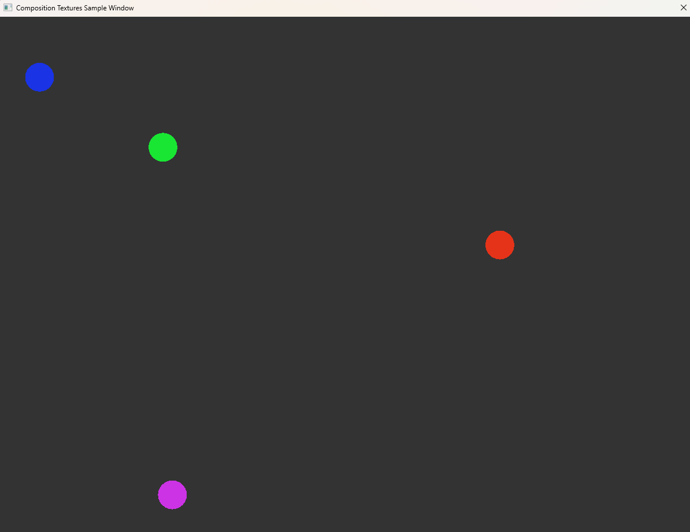

Dynamic Texture Demo Sample
=============================================
This sample demonstrates how to use the new DirectComposition dynamic texture API to optimize rendering performance of your app that uses composition textures. In this demo, we leverage the new `IDCompositionDynamicTexture` interface (created via `IDCompositionDevice5`) which provides two update methods: one that updates the entire composition texture, and another that accepts an array of dirty rectangles — allowing Windows to redraw only the parts that have changed.

## Overview
This demo renders a scene with four bouncing balls. Instead of redrawing the whole scene every frame, the sample tracks each ball’s movement and updates only 8 small rectangles per frame (covering both the previous and new positions of the balls). 

On initialization step this sample app checks if new `IDCompositionDevice5` interface is present on the dcomp device, and creates a `IDCompositionDynamicTexture`. If dynamic texture was succesfully created, app will send an information about dirty rects to dcomp via `SetTexture(pTexture, pRects, rectCount)` call. 

Build the sample
----------------

To build this sample:

1.  Start Visual Studio and select **File** \> **Open** \> **Project/Solution**.
2.  Go to the directory named for the sample. Go to the cpp directory and double-click the Visual Studio Solution (.sln) file.
3.  Press F6 or use **Build** \> **Build Solution** to build the sample.

Run the sample
--------------
To run this sample after building it, use Windows Explorer to go to the installation folder for this sample and run DirectCompositionTextureAndDynamicTexture.exe from the *\<install\_root\>*\\Samples\DirectCompositionTextureAndDynamicTexture\cpp\x64\Debug folder.

To run this sample from Microsoft Visual Studio, press the F5 key to run with debugging enabled, or Ctrl+F5 to run without debugging enabled. Alternatively, select **Start Debugging** or **Start Without Debugging** from the **Debug** menu.
